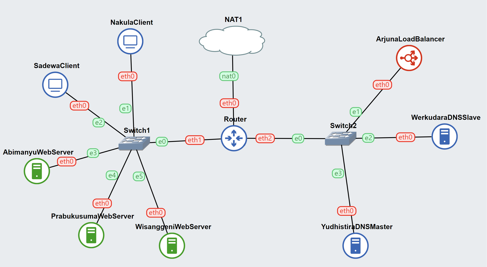
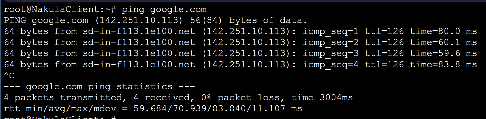

# Jarkom-Modul-2-B09-2023

## Anggota Kelompok
| Nama | NRP |
|---------------------------|------------|
|Wan Sabrina Mayzura | 5025211023 |
|Syarifah Talitha Erfany | 5025211175 |

## Daftar Isi
- [Daftar Isi](#daftar-isi)
  - [Topologi](#topologi)
  - [Config](#config)
- [Soal 1](#Soal-1)
  - [Script](#script)
  - [Result](#result)
- [Soal 2](#Soal-2)
  - [Script](#script-1)
  - [Result](#result-1)
- [Soal 3](#Soal-3)
  - [Script](#script-2)
  - [Result](#result-2)
- [Soal 4](#Soal-4)
  - [Script](#script-3)
  - [Result](#result-3)
- [Soal 5](#Soal-5)
  - [Script](#script-4)
  - [Result](#result-4)
- [Soal 6](#Soal-6)
  - [Script](#script-5)
  - [Result](#result-5)
- [Soal 7](#Soal-7)
  - [Script](#script-6)
  - [Result](#result-6)
- [Soal 8](#Soal-8)
  - [Script](#script-7)
  - [Result](#result-7)
- [Soal 9](#Soal-9)
  - [Script](#script-8)
  - [Result](#result-8)
- [Soal 10](#Soal-10)
  - [Script](#script-9)
  - [Result](#result-9)
- [Soal 11](#Soal-11)
  - [Script](#script-10)
  - [Result](#result-10)
- [Soal 12](#Soal-12)
  - [Script](#script-11)
  - [Result](#result-11)
- [Soal 13](#Soal-13)
  - [Script](#script-12)
  - [Result](#result-12)
- [Soal 14](#Soal-14)
  - [Script](#script-13)
  - [Result](#result-13)
- [Soal 15](#Soal-15)
  - [Script](#script-14)
  - [Result](#result-14)
- [Soal 16](#Soal-16)
  - [Script](#script-15)
  - [Result](#result-15)
- [Soal 17](#Soal-17)
  - [Script](#script-16)
  - [Result](#result-16)
- [Soal 18](#Soal-18)
  - [Script](#script-17)
  - [Result](#result-17)
- [Soal 19](#Soal-19)
  - [Script](#script-18)
  - [Result](#result-18)
- [Soal 20](#Soal-20)
  - [Script](#script-19)
  - [Result](#result-19)

## Topologi


## Config 
- **Router**
  ```
    auto eth0
    iface eth0 inet dhcp

    auto eth1
    iface eth1 inet static
        address 10.10.1.1
        netmask 255.255.255.0

    auto eth2
    iface eth2 inet static
        address 10.10.2.1
        netmask 255.255.255.0
  ```
- **Nakula**
  ```
    auto eth0
    iface eth0 inet static
	    address 10.10.1.2
	    netmask 255.255.255.0
	    gateway 10.10.1.1
  ```
- **Sadewa**
  ```
    auto eth0
    iface eth0 inet static
        address 10.10.1.3
        netmask 255.255.255.0
        gateway 10.10.1.1
  ```
- **Abimanyu**
  ```
    auto eth0
    iface eth0 inet static
        address 10.10.1.4
        netmask 255.255.255.0
        gateway 10.10.1.1
  ```
- **Prabukusuma**
  ```
    auto eth0
    iface eth0 inet static
        address 10.10.1.5
        netmask 255.255.255.0
        gateway 10.10.1.1
  ```
- **Wisanggeni**
  ```
    auto eth0
    iface eth0 inet static
        address 10.10.1.6
        netmask 255.255.255.0
        gateway 10.10.1.1
  ```
- **Arjuna**
  ```
    auto eth0
    iface eth0 inet static
        address 10.10.2.2
        netmask 255.255.255.0
        gateway 10.10.2.1
  ```
- **Werkudara**
  ```
    auto eth0
    iface eth0 inet static
        address 10.10.2.3
        netmask 255.255.255.0
        gateway 10.10.2.1
  ```
- **Yudhistira**
  ```
    auto eth0
    iface eth0 inet static
        address 10.10.2.4
        netmask 255.255.255.0
        gateway 10.10.2.1
  ```
- **Notes of Config**
  ```
  Router	: 10.10.1.1 (Switch 1)
  Yudhistira	: 192.173.2.4
  Nakula	        : 192.173.1.2
  Router	: 10.10.2.1 (Switch 2)
  Werkudara	: 192.173.2.2
  Sadewa	        : 192.173.2.3
  Arjuna	        : 192.173.2.2
  ```

## Soal 1 
> Yudhistira akan digunakan sebagai DNS Master, Werkudara sebagai DNS Slave, Arjuna merupakan Load Balancer yang terdiri dari beberapa Web Server yaitu Prabakusuma, Abimanyu, dan Wisanggeni. Buatlah topologi dengan pembagian sebagai berikut. Folder topologi dapat diakses pada drive berikut

### Script
**Pada semua Node**

masukkan di dalam .bashrc di root:
```
echo nameserver 192.168.122.1 > `/etc/resolv.conf`
```

**Nakula**

Untuk client, nano `/etc/resolv.conf`
```
nameserver 192.168.122.1
nameserver 10.10.2.4 #IP Yudhistira
nameserver 10.10.2.3 #IP Werkudara
```

Lalu pada semua node, pastikan sudah bisa menjalankan:
```
ping google.com
```
### Result



**Kendala:** Tidak ada kendala didalam mengerjakan nomor ini.

## Soal 2 
> Buatlah website utama dengan akses ke arjuna.yyy.com dengan alias www.arjuna.yyy.com dengan yyy merupakan kode kelompok.
Config

### Script

**Yudhistira**
1. Dalam `arjuna.B03.com`
```
;
; BIND data file for local loopback interface
;
$TTL    604800
@       IN      SOA     arjuna.B03.com. root.arjuna.B03.com. (
                        2023100901      ; Serial
                         604800         ; Refresh
                          86400         ; Retry
                        2419200         ; Expire
                         604800 )       ; Negative Cache TTL
;
@       IN      NS      arjuna.B03.com.
@       IN      A       10.10.2.2        ; IP arjuna karena point ke arjuna
www     IN      CNAME   arjuna.B03.com.
@       IN	    AAAA    ::1
```

2. nano `named.conf.local` yang berada di root agar tidak hilang
```
zone “arjuna.B03.com" {
    type master;
    file "/etc/bind/arjuna/arjuna.B03.com";
};
```

3. No2.sh
```
#!bin/bash

echo '
zone "arjuna.B03.com" {
    type master;
    file "/etc/bind/arjuna/arjuna.B03.com";
};' >> /etc/bind/named.conf.local

mkdir /etc/bind/arjuna
cp arjuna.B03.com /etc/bind/arjuna/arjuna.B03.com

service bind9 restart
```

**Nakula**
```
ping arjuna.B03
ping www.arjuna.B03.com
```

### Result


**Kendala:** Tidak ada kendala didalam mengerjakan nomor ini.

## Soal 3
> Dengan cara yang sama seperti soal nomor 2, buatlah website utama dengan akses ke abimanyu.yyy.com dan alias www.abimanyu.yyy.com.

### Script

**Yudhistira**
```
```

**Abimanyu**
```
```

### Result


**Kendala:** Tidak ada kendala didalam mengerjakan nomor ini.

## Soal 4
> Kemudian, karena terdapat beberapa web yang harus di-deploy, buatlah subdomain parikesit.abimanyu.yyy.com yang diatur DNS-nya di Yudhistira dan mengarah ke Abimanyu.

### Script

**Yudhistira**

```
```

**Abimanyu**
```
```

### Result


**Kendala:** Tidak ada kendala didalam mengerjakan nomor ini.

## Soal 5
> Buat juga reverse domain untuk domain utama.

### Script

**Yudhistira**
```
```

**Abimanyu / Client yang lain**
```
```

### Result


**Kendala:** Tidak ada kendala didalam mengerjakan nomor ini.

## Soal 6
> Agar dapat tetap dihubungi ketika DNS Server Yudhistira bermasalah, buat juga Werkudara sebagai DNS Slave untuk domain utama.

### Script
**Yudhistira**
```
```

**Werkudara (DNS Slave)**
```
```

**Abimanyu**
```
```

### Result


**Kendala:** Tidak ada kendala didalam mengerjakan nomor ini.

## Soal 7
> Seperti yang kita tahu karena banyak sekali informasi yang harus diterima, buatlah subdomain khusus untuk perang yaitu baratayuda.abimanyu.yyy.com dengan alias www.baratayuda.abimanyu.yyy.com yang didelegasikan dari Yudhistira ke Werkudara dengan IP menuju ke Abimanyu dalam folder Baratayuda

### Script
**Yudhistira**

```
```

**Werkudara**
```
```

### Result


**Kendala:** Tidak ada kendala didalam mengerjakan nomor ini.

## Soal 8
> Untuk informasi yang lebih spesifik mengenai Ranjapan Baratayuda, buatlah subdomain melalui Werkudara dengan akses rjp.baratayuda.abimanyu.yyy.com dengan alias www.rjp.baratayuda.abimanyu.yyy.com yang mengarah ke Abimanyu.

**Werkudara**

Jalankan `nano /etc/bind/baratayuda/baratayuda.abimanyu.B03.com` dan edit menjadi seperti ini.
```
;
; BIND data file for local loopback interface
;
$TTL    604800
@       IN      SOA     baratayuda.abimanyu.B03.com. root.baratayuda.abimanyu.B03.com. (
                        2023100901      ; Serial
                        604800         ; Refresh
                        86400          ; Retry
                        2419200        ; Expire
                        604800 )       ; Negative Cache TTL
;
@       IN      NS      baratayuda.abimanyu.B03.com.
@       IN      A       10.10.1.4       ; IP abimanyu
www     IN      CNAME   baratayuda.abimanyu.B03.com.
rjp     IN      A       10.10.1.4       ; IP abimanyu
www.rjp IN      CNAME   rjp.baratayuda.abimanyu.B03.com.
@       IN      AAAA    ::1
```

### Script

Karena saya menyimpan file baratayuda.abimanyu.B0.com di root, oleh karena itu script shell yang digunakan untuk nomor ini adalah:
```shell
#!bin/bash

cp baratayuda.abimanyu.B03.com /etc/bind/baratayuda/baratayuda.abimanyu.B03.com
service bind9 restart
```
### Testing
Pada client Nakula, jalankan `ping.www.baratayuda.abimanyu.B03.com`


**Kendala:** Tidak ada kendala didalam mengerjakan nomor ini.

## Soal 9
> Arjuna merupakan suatu Load Balancer Nginx dengan tiga worker yaitu Prabakusuma, Abimanyu, dan Wisanggeni. Lakukan deployment pada masing-masing worker

### Script
**Arjuna (Load Balancing)**
```
echo '
 # Default menggunakan Round Robin
 upstream myweb  {
 	server 10.10.1.4; #IP abimanyu
 	server 10.10.1.5; #IP prabukusuma
 	server 10.10.1.6; #IP wisanggeni

 }

 server {
 	listen 80;
 	server_name arjuna.B03.com;

 	location / {
 	proxy_pass http://myweb;
 	}
 }
' > /etc/nginx/sites-available/lb-arjuna

ln -s /etc/nginx/sites-available/lb-arjuna /etc/nginx/sites-enabled
service nginx restart
```

**Prabukusuma, Abimanyu, Wisanggeni**
- Masukin di nano .bashrc `apt-get update && apt install nginx php php-fpm -y` untuk menginstall dependencies tersebut.
- Cek versi PHP `php -v`
- Buat directory baru di `/var/www/arjuna`
- Masuk directory `/var/www/arjuna` dan bikin file `index.php` yang didapatkan dari asset resource file `arjuna.yyy.zip`
- Melakukan konfigurasi pada nginx, nano pada `/etc/nginx/sites-available/arjuna`, namun saya copy dari /etc/nginx/sites-available/arjuna ke root, agar tetap tersimpan konfigurasi yang dilakukan.
- Isi dari file arjuna adalah konfigurasi server block:
  ```
    server {

    listen 80;

    root /var/www/arjuna;

    index index.php index.html index.htm;
    server_name _;

    location / {
        try_files $uri $uri/ /index.php?$query_string;
    }

    # pass PHP scripts to FastCGI server
    location ~ \.php$ {
    include snippets/fastcgi-php.conf;
    fastcgi_pass unix:/var/run/php/php7.0-fpm.sock;
    }

  location ~ /\.ht {
        deny all;
    }

    error_log /var/log/nginx/arjuna_error.log;
    access_log /var/log/nginx/arjuna_access.log;
  }
  ```
- Buat symlink  `ln -s /etc/nginx/sites-available/arjuna /etc/nginx/sites-enabled`
- Restart nginx `service nginx restart`
- Script `no9.sh`
  ```
  #!bin/bash

  mkdir /var/www/arjuna

  echo '<?php
  $hostname = gethostname();
  $date = date('Y-m-d H:i:s');
  $php_version = phpversion();
  $username = get_current_user();

  echo "Hello World!<br>";
  echo "Saya adalah: $username<br>";
  echo "Saat ini berada di: $hostname<br>";
  echo "Versi PHP yang saya gunakan: $php_version<br>";
  echo "Tanggal saat ini: $date<br>";
  ?>' > /var/www/arjuna/index.php

  cp arjuna /etc/nginx/sites-available/arjuna

  ln -s /etc/nginx/sites-available/arjuna /etc/nginx/sites-enabled

  service php7.0-fpm start
  service nginx restart
  ```

- Lalu ulangi langkah di atas pada node worker worker lainnya, hingga sudah disetting semuanya pada node Prabakusuma, Abimanyu, dan Wisanggeni.

### Testing
Pada client Nakula, pastikan pada `/etc/resolv.conf` terdapat nameserver yudhistira dan werkudara dan install dependencies `apt-get update && apt-get install lynx` (dimasukkan ke .bashrc).

Lalu testing dengan menjalankan `lynx http://arjuna.B03.com`

- Prabakusuma

  

- Abimanyu

  

- Wisanggeni

  

**Kendala:** Tidak ada kendala didalam mengerjakan nomor ini.

## Soal 10
> Kemudian gunakan algoritma Round Robin untuk Load Balancer pada Arjuna. Gunakan server_name pada soal nomor 1. Untuk melakukan pengecekan akses alamat web tersebut kemudian pastikan worker yang digunakan untuk menangani permintaan akan berganti ganti secara acak. Untuk webserver di masing-masing worker wajib berjalan di port 8001-8003. Contoh (Prabakusuma:8001, Abimanyu:8002, Wisanggeni:8003)

### Script

**Arjuna (Load Balancing)**
- Pada ArjunaLoadBalancer, yang diubah dari no 9 adalah isi file `lb-arjuna` menjadi sebagai berikut:
  ```
  # Default menggunakan Round Robin
  upstream myweb  {
    server 10.10.1.4: 8002; #IP abimanyu
    server 10.10.1.5: 8001; #IP prabukusuma
    server 10.10.1.6: 8003; #IP wisanggeni
  }

  server {
    listen 80;
    server_name arjuna.B03.com;

    location / {
    proxy_pass http://myweb;
    }
  }
  server {
    listen 8001;
    server_name arjuna.B03.com;

    location / {
    proxy_pass http://myweb;
    }
  }
  server {
    listen 8002;
    server_name arjuna.B03.com;

    location / {
    proxy_pass http://myweb;
    }
  }
  server {
    listen 8003;
    server_name arjuna.B03.com;

    location / {
    proxy_pass http://myweb;
    }
  }
  ```
- Lalu jalankan `service nginx restart`.

**Prabakusuma**

Pada Prabakusuma, edit file arjuna pada root, hapus `listen 80` dan tambahkan `listen 8001` pada konfigurasi server block.
```
server {

 	listen 8001;

 	root /var/www/arjuna;

 	index index.php index.html index.htm;
 	server_name _;

 	location / {
 			try_files $uri $uri/ /index.php?$query_string;
 	}

 	# pass PHP scripts to FastCGI server
 	location ~ \.php$ {
 	include snippets/fastcgi-php.conf;
 	fastcgi_pass unix:/var/run/php/php7.0-fpm.sock;
 	}

 location ~ /\.ht {
 			deny all;
 	}

 	error_log /var/log/nginx/arjuna_error.log;
 	access_log /var/log/nginx/arjuna_access.log;
 }
```

**Abimanyu**

Pada Abimanyu, edit file arjuna pada root, hapus `listen 80` dan tambahkan `listen 8002` pada konfigurasi server block.
```
server {

 	listen 8002;

 	root /var/www/arjuna;

 	index index.php index.html index.htm;
 	server_name _;

 	location / {
 			try_files $uri $uri/ /index.php?$query_string;
 	}

 	# pass PHP scripts to FastCGI server
 	location ~ \.php$ {
 	include snippets/fastcgi-php.conf;
 	fastcgi_pass unix:/var/run/php/php7.0-fpm.sock;
 	}

 location ~ /\.ht {
 			deny all;
 	}

 	error_log /var/log/nginx/arjuna_error.log;
 	access_log /var/log/nginx/arjuna_access.log;
 }
```

**Wisanggeni**

Pada Wisanggeni, edit file arjuna pada root, hapus `listen 80` dan tambahkan `listen 8003` pada konfigurasi server block.
```
server {

 	listen 8003;

 	root /var/www/arjuna;

 	index index.php index.html index.htm;
 	server_name _;

 	location / {
 			try_files $uri $uri/ /index.php?$query_string;
 	}

 	# pass PHP scripts to FastCGI server
 	location ~ \.php$ {
 	include snippets/fastcgi-php.conf;
 	fastcgi_pass unix:/var/run/php/php7.0-fpm.sock;
 	}

 location ~ /\.ht {
 			deny all;
 	}

 	error_log /var/log/nginx/arjuna_error.log;
 	access_log /var/log/nginx/arjuna_access.log;
 }
```
### Testing
Pada client Nakula, pastikan pada `/etc/resolv.conf` terdapat nameserver yudhistira dan werkudara dan install dependencies `apt-get update && apt-get install lynx` (dimasukkan ke .bashrc).

- Testing dengan menjalankan `lynx http://arjuna.B03.com:8001`

- Testing dengan menjalankan `lynx http://arjuna.B03.com:8002`

- Testing dengan menjalankan `lynx http://arjuna.B03.com:8003`


**Kendala:** Tidak ada kendala didalam mengerjakan nomor ini.

## Soal 11
> Selain menggunakan Nginx, lakukan konfigurasi Apache Web Server pada worker Abimanyu dengan web server www.abimanyu.yyy.com. Pertama dibutuhkan web server dengan DocumentRoot pada /var/www/abimanyu.yyy

**Abimanyu**
- Di root, simpan file `abimanyu.B03.com.conf`, dan isinya sebagai berikut:
  ```shell
  <VirtualHost *:80>
    ServerAdmin webmaster@localhost
    DocumentRoot /var/www/abimanyu.B03
    ServerName abimanyu.B03.com
    ServerAlias www.abimanyu.B03.com

    ErrorLog ${APACHE_LOG_DIR}/error.log
    CustomLog ${APACHE_LOG_DIR}/access.log combined
  </VirtualHost>  
  ```
- Buat directory var/www/abimanyu.B03
- Untuk mengambil asset dari resource untuk webserver abimanyu.B03.com, digunakan metode git clone dari repository `http.sslVerify=false clone https://github.com/bombshelll/abimanyu.B03.com` yang akan di copy kedalam directory /var/www/abimanyu.B03


### Script
```
service nginx stop

rm -r /var/www/abimanyu.B03

cp abimanyu.B03.com.conf /etc/apache2/sites-available/abimanyu.B03.com.conf

a2ensite abimanyu.B03.com.conf

mkdir -p /var/www/abimanyu.B03
apt-get install git -y
git -c http.sslVerify=false clone https://github.com/bombshelll/abimanyu.B03.com /var/www/abimanyu.B03

service apache2 restart
```

### Testing
Pada client Nakula, testing dengan menjalankan `lynx http://abimanyu.B03.com/index.php/home`


**Kendala:** Tidak ada kendala didalam mengerjakan nomor ini.

## Soal 12
> Setelah itu ubahlah agar url www.abimanyu.yyy.com/index.php/home menjadi www.abimanyu.yyy.com/home.
**Abimanyu**
- Di dalam `abimanyu.B03.com.conf`, tambahkan:
  ```shell
  <VirtualHost *:80>
    ServerAdmin webmaster@localhost
    DocumentRoot /var/www/abimanyu.B03
    ServerName abimanyu.B03.com
    ServerAlias www.abimanyu.B03.com

    <Directory /var/www/abimanyu.B03/index.php/home>
          Options +Indexes
    </Directory>

    Alias "/home" "/var/www/abimanyu.B03/index.php/home"

    ErrorLog ${APACHE_LOG_DIR}/error.log
    CustomLog ${APACHE_LOG_DIR}/access.log combined
  </VirtualHost>  
  ```

### Testing
Pada client Nakula, testing dengan menjalankan
`lynx http://abimanyu.B03.com/home`


**Kendala:** Tidak ada kendala didalam mengerjakan nomor ini.

## Soal 13
> Selain itu, pada subdomain www.parikesit.abimanyu.yyy.com, DocumentRoot disimpan pada /var/www/parikesit.abimanyu.yyy

**Abimanyu**
- Di root, simpan file `parikesit.abimanyu.B03.com.conf`, dan isinya sebagai berikut:
  ```shell
  <VirtualHost *:80>
    ServerAdmin webmaster@localhost
    DocumentRoot /var/www/parikesit.abimanyu.B03
    ServerName parikesit.abimanyu.B03.com
    ServerAlias www.parikesit.abimanyu.B03.com

    ErrorLog ${APACHE_LOG_DIR}/error.log
    CustomLog ${APACHE_LOG_DIR}/access.log combined
  </VirtualHost>  
  ```
- Buat directory var/www/parikesit.abimanyu.B03
- Untuk mengambil asset dari resource untuk webserver parikesit.abimanyu.B03.com, digunakan metode git clone dari repository `http.sslVerify=false clone https://github.com/bombshelll/parikesit.abimanyu.B03.com` yang akan di copy kedalam directory /var/www/parikesit.abimanyu.B03

### Script
```
service nginx stop

rm -r /var/www/parikesit.abimanyu.B03

cp parikesit.abimanyu.B03.com.conf /etc/apache2/sites-available/parikesit.abimanyu.B03.com.conf

a2ensite parikesit.abimanyu.B03.com.conf

mkdir -p /var/www/parikesit.abimanyu.B03
apt-get install git -y
git -c http.sslVerify=false clone https://github.com/bombshelll/parikesit.abimanyu.B03.com /var/www/parikesit.abimanyu.B03

service apache2 restart
```

### Testing
Pada client Nakula, testing dengan menjalankan `lynx http://parikesit.abimanyu.B03.com/index.php/home`


**Kendala:** Tidak ada kendala didalam mengerjakan nomor ini.

## Soal 14
> Pada subdomain tersebut folder /public hanya dapat melakukan directory listing sedangkan pada folder /secret tidak dapat diakses (403 Forbidden)

**Abimanyu**

Jalankan script di bawah ini, dimana untuk directory public, menggunakan `+Indexes` sedangkan pada directory secret menggunakan `-Indexes`.
### Script
  ```shell
  echo '<VirtualHost *:80>
  ServerAdmin webmaster@localhost
  DocumentRoot /var/www/parikesit.abimanyu.B03
  ServerName parikesit.abimanyu.B03.com
  ServerAlias www.parikesit.abimanyu.B03.com

  <Directory /var/www/parikesit.abimanyu.B03/public>
          Options +Indexes
  </Directory>

  <Directory /var/www/parikesit.abimanyu.B03/secret>
          Options -Indexes
  </Directory>

  Alias "/public" "/var/www/parikesit.abimanyu.B03/public"
  Alias "/secret" "/var/www/parikesit.abimanyu.B03/secret"

  ErrorLog ${APACHE_LOG_DIR}/error.log
  CustomLog ${APACHE_LOG_DIR}/access.log combined
  </VirtualHost>' > /etc/apache2/sites-available/parikesit.abimanyu.B03.com.conf

  service apache2 restart
  ```

### Testing
Pada client Nakula, testing dengan menjalankan:
- lynx parikesit.abimanyu.B03.com/public

  
- lynx parikesit.abimanyu.B03.com/secret

  
  

**Kendala:** Tidak ada kendala didalam mengerjakan nomor ini.

## Soal 15
> Buatlah kustomisasi halaman error pada folder /error untuk mengganti error kode pada Apache. Error kode yang perlu diganti adalah 404 Not Found dan 403 Forbidden.
**Abimanyu**
Jalankan script di bawah ini, dimana untuk error dengan kode 404, menggunakan `ErrorDocument 404 /error/404.html` dan untuk error kode 403 menggunakan `ErrorDocument 403 /error/403.html`.
### Script
  ```shell
  echo '<VirtualHost *:80>
  ServerAdmin webmaster@localhost
  DocumentRoot /var/www/parikesit.abimanyu.B03
  ServerName parikesit.abimanyu.B03.com
  ServerAlias www.parikesit.abimanyu.B03.com

  <Directory /var/www/parikesit.abimanyu.B03/public>
          Options +Indexes
  </Directory>

  <Directory /var/www/parikesit.abimanyu.B03/secret>
          Options -Indexes
  </Directory>

  Alias "/public" "/var/www/parikesit.abimanyu.B03/public"
  Alias "/secret" "/var/www/parikesit.abimanyu.B03/secret"

  ErrorDocument 404 /error/404.html
  ErrorDocument 403 /error/403.html

  ErrorLog ${APACHE_LOG_DIR}/error.log
  CustomLog ${APACHE_LOG_DIR}/access.log combined
  </VirtualHost>' > /etc/apache2/sites-available/parikesit.abimanyu.B03.com.conf

  service apache2 restart
  ```

### Testing
Pada client Nakula, testing dengan menjalankan:
- lynx parikesit.abimanyu.B03.com/asalasalan


- lynx parikesit.abimanyu.B03.com/secret


**Kendala:** Tidak ada kendala didalam mengerjakan nomor ini.

## Soal 16
> Buatlah suatu konfigurasi virtual host agar file asset www.parikesit.abimanyu.yyy.com/public/js menjadi www.parikesit.abimanyu.yyy.com/js 

**Abimanyu**
Sama seperti nomor 12, pada file `parikesit.abimanyu.B03.com.conf`, tambahkan alias untuk path `/var/www/parikesit.abimanyu.B03/public/js`.
### Script
```shell
echo '<VirtualHost *:80>
  ServerAdmin webmaster@localhost
  DocumentRoot /var/www/parikesit.abimanyu.B03
  ServerName parikesit.abimanyu.B03.com
  ServerAlias www.parikesit.abimanyu.B03.com

  <Directory /var/www/parikesit.abimanyu.B03/public>
          Options +Indexes
  </Directory>

  <Directory /var/www/parikesit.abimanyu.B03/secret>
          Options -Indexes
  </Directory>

  Alias "/public" "/var/www/parikesit.abimanyu.B03/public"
  Alias "/secret" "/var/www/parikesit.abimanyu.B03/secret"
  Alias "/js" "/var/www/parikesit.abimanyu.B03/public/js"

  ErrorDocument 404 /error/404.html
  ErrorDocument 403 /error/403.html

  ErrorLog ${APACHE_LOG_DIR}/error.log
  CustomLog ${APACHE_LOG_DIR}/access.log combined
</VirtualHost>' > /etc/apache2/sites-available/parikesit.abimanyu.B03.com.conf

service apache2 restart
```
### Testing
Pada client Nakula, testing dengan menjalankan `lynx parikesit.abimanyu.B03.com/js`


**Kendala:** Tidak ada kendala didalam mengerjakan nomor ini.

## Soal 17
> Agar aman, buatlah konfigurasi agar www.rjp.baratayuda.abimanyu.yyy.com hanya dapat diakses melalui port 14000 dan 14400.

**Abimanyu**
Sama seperti pada nomor-nomor sebelumnya, namun pada portnya, tidak digunakan 80, melainkan `<VirtualHost *:14000 *:14400>`.
### Script
  ```shell
  echo '<VirtualHost *:14000 *:14400>
  ServerAdmin webmaster@localhost
  DocumentRoot /var/www/rjp.baratayuda.abimanyu.B03
  ServerName rjp.baratayuda.abimanyu.B03.com
  ServerAlias www.rjp.baratayuda.abimanyu.B03.com

  ErrorDocument 404 /error/404.html
  ErrorDocument 403 /error/403.html

  ErrorLog ${APACHE_LOG_DIR}/error.log
  CustomLog ${APACHE_LOG_DIR}/access.log combined
  </VirtualHost>' > /etc/apache2/sites-available/rjp.baratayuda.abimanyu.B03.com.conf

  cp ports.conf /etc/apache2/ports.conf

  mkdir -p /var/www/rjp.baratayuda.abimanyu.B03
  apt-get install git -y
  git -c http.sslVerify=false clone https://github.com/bombshelll/rjp.baratayuda.abimanyu.B03.com /var/www/rjp.baratayuda.abimanyu.B03

  a2ensite rjp.baratayuda.abimanyu.B03.com.conf

  service apache2 restart
  ```
### Testing
Pada client Nakula, testing dengan menjalankan:
- lynx rjp.baratayuda.abimanyu.B03.com:14000

- lynx rjp.baratayuda.abimanyu.B03.com:14400

- Saat tidak menggunakan kedua port di atas


**Kendala:** Tidak ada kendala didalam mengerjakan nomor ini.

## Soal 18
> Untuk mengaksesnya buatlah autentikasi username berupa “Wayang” dan password “baratayudayyy” dengan yyy merupakan kode kelompok. Letakkan DocumentRoot pada /var/www/rjp.baratayuda.abimanyu.yyy.

**Abimanyu**
Pada file `rjp.baratayuda.abimanyu.B03.com.conf` tambahkan seperti script di bawah ini.

### Script
```shell
  echo '<VirtualHost *:14000 *:14400>
  ServerAdmin webmaster@localhost
  DocumentRoot /var/www/rjp.baratayuda.abimanyu.B03
  ServerName rjp.baratayuda.abimanyu.B03.com
  ServerAlias www.rjp.baratayuda.abimanyu.B03.com

    <Directory /var/www/html/rjp.baratayuda.abimanyu.B03>
        AuthType Basic
        AuthName "Protected"
        AuthUserFile /etc/apache2/.htpasswd
        Require valid-user
    <Directory>

  ErrorDocument 404 /error/404.html
  ErrorDocument 403 /error/403.html

  ErrorLog ${APACHE_LOG_DIR}/error.log
  CustomLog ${APACHE_LOG_DIR}/access.log combined
  </VirtualHost>' > /etc/apache2/sites-available/rjp.baratayuda.abimanyu.B03.com.conf

  service apache2 restart
  ```

### Testing
Pada Abimanyu, setup username dan password dengan menjalankan `htpasswd -c /etc/apache2/.htpasswd Wayang` dan set password menjadi `baratayudaB03`


Lalu pada client Nakula:
- Jalankan lynx rjp.baratayuda.abimanyu.B03.com:14400 (atau tanpa port jika belum menjalankan nomor 17)

- Memasukkan username

- Memasukkan password

- Autentikasi sukses


**Kendala:** Tidak ada kendala didalam mengerjakan nomor ini.

## Soal 19
> Buatlah agar setiap kali mengakses IP dari Abimanyu akan secara otomatis dialihkan ke www.abimanyu.yyy.com (alias)

### Script
**Abimanyu**
```
```

Config test
```
```

**Client (Sadewa)**
```
```

### Result


**Kendala:** Tidak ada kendala didalam mengerjakan nomor ini.

## Soal 20
> Karena website www.parikesit.abimanyu.yyy.com semakin banyak pengunjung dan banyak gambar gambar random, maka ubahlah request gambar yang memiliki substring “abimanyu” akan diarahkan menuju abimanyu.png.

### Script
**Abimanyu**
```
```

**Client (Sadewa)**
```

```
### Result


**Kendala:** Nomor ini tidak dapat diselesaikan pada masa praktikum, sehingga diselesaikan pada masa revisi.